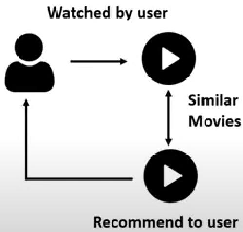

# Movie-Recommender-System

A movie recommendation system also known as Movie Recommender System uses machine learning to predict or filter users' film preferences based on prior decisions and actions.

All recommender systems have 2 components:
<ul>
	<li> Users
	<li> Items (in this case, Movies)

<b>Main Objective:</b> Filter and predict the movies that the user is most likely to watch.

Among the many filters used, I decided to go with Content-based Filtering.

## Content-based Filtering

## Working of the Model
<ol>
    <li> Data Preparation
        <ul>
            <li> Create a data frame with movie title, movie id and tags
            <li> Tags contain all relevant items like the cast, crew, genre, description, keywords, etc.
            <li> We drop any null values and duplicate values present in the tags section
        </ul>
    </li>
    <li> Pre-processing
        <ul>
            <li> We first apply stemming to the tags column.
            <li> Create a matrix where we vectorize the tags section using CountVectorizer
        </ul>
    </li>
	<li> Using cosine similarity, we find the similarities between different vectors.
	<li> To find similar movies, we get the top 5 values from the cosine similarity
    <li> Return the movie titles at those indices.
